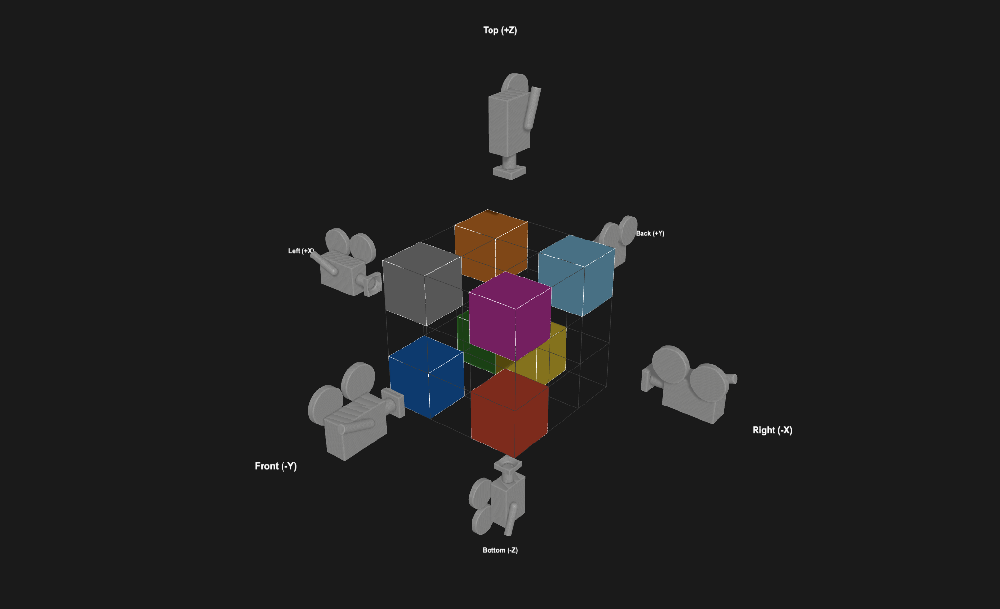
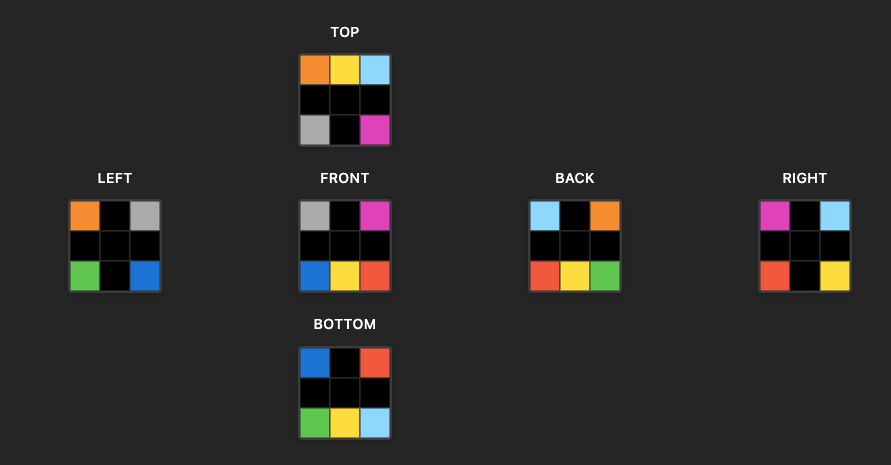
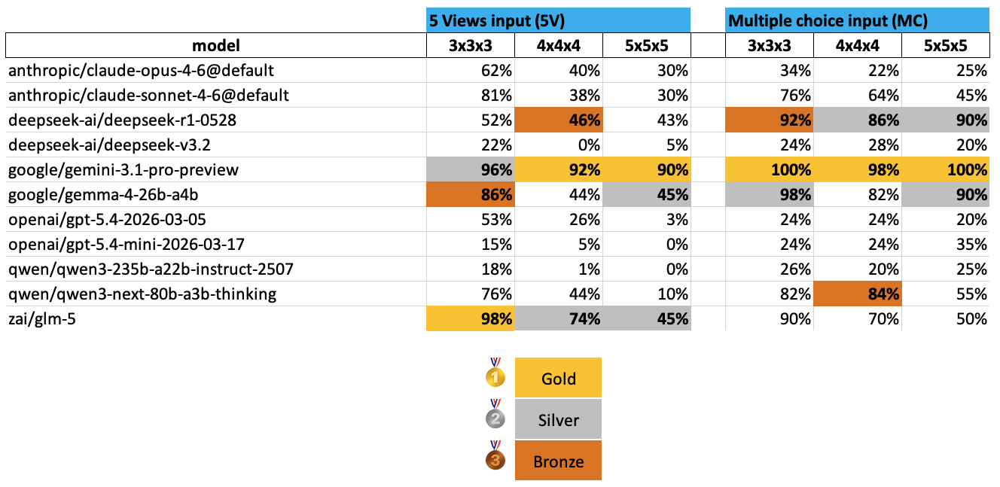

### 3D Spatial Reasoning from Orthographic Projections


### Your Team
I am an Independent Researcher.

### Problem Statement

**Core challenge:** Can AI models reconstruct 3D structure from partial 2D observations through mental transformation?

Given two orthographic projections of a 3D voxel scene (front and top views), models must infer the underlying 3D structure and predict a third, unseen projection (right view). This tests **executive functions**—specifically working memory, mental rotation, and cognitive flexibility.


*A simple 3x3x3 reference scene in 3D with camera positions for the 6 views*
<br>


*The 6 orthographic views from the scene above*
<br>

**Why Executive Functions, Not Perception?**

At first glance, this task might seem to test visual perception (3D structure inference, spatial localization, scene understanding). However, the cognitive bottleneck is not *recognizing what's there* (perception) but *transforming it to predict what it becomes from a new angle* (executive functions).

The key distinction:
- **Perception** answers: "What is visible? Where are objects located?"
- **Executive Functions** answers: "What would this look like if rotated/transformed?"

Our task is fundamentally **generative spatial transformation**, not passive recognition. The 2D inputs are already abstracted (symbolic grids with integer values 0-9)—perceptual work is done. What remains is:

1. **Working Memory**: Holding multiple coordinate frames simultaneously while integrating constraints
2. **Mental Rotation**: Actively transforming the mental model to predict unseen perspectives  
3. **Cognitive Flexibility**: Switching between 2D projections and 3D structure

The Shepard-Metzler mental rotation task ([Wiki Mental Rotation](https://en.wikipedia.org/wiki/Mental_rotation)) is canonically classified as an executive function test in cognitive psychology because reaction time scales with rotation angle—revealing active transformation, not passive matching. Our task amplifies this by requiring 3D reconstruction *before* rotation.

**Why this matters for AGI:** Spatial transformation is a core cognitive primitive underlying engineering design, robotics, medical imaging (CT/MRI reconstruction), and tool use. Unlike existing benchmarks that test whether models can *match* rotated views (SpinBench) or *adopt perspectives* within a single image (ViewSpatial-Bench), we test whether models can *construct* 3D structure from sparse, multi-view observations—a fundamentally harder operation.

**Text-only format:** All models interact with the benchmark using ASCII grid representations, which is universally supported across all LLM architectures and avoids vision-specific confounds like texture, lighting, or perspective cues. This ensures we test pure spatial reasoning, not visual perception capabilities.

---

### Task & benchmark construction
**Comparison with Existing Benchmarks:**

| Dimension | SpinBench | ViewSpatial-Bench | Our Benchmark |
|-----------|-----------|-------------------|---------------|
| **Input** | All views provided | Single rich image | Sparse views (2 or 5) |
| **Reasoning** | Match/classify views | Perspective-taking within scene | Construct 3D, predict unseen view |
| **3D Reconstruction** | Not required | Not required | **Core task** |
| **Modality** | Vision-only | Vision-only | **Text-only** |
| **Stimuli** | Photographs (confounded) | Photographs (confounded) | Synthetic grids (controlled) |

<br>
**Unique contributions:**
1. **Constructive multi-view reasoning**: First benchmark requiring 3D inference from incomplete projections
2. **Text-only spatial reasoning**: Universal format testing pure geometric reasoning without vision confounds
3. **Symbolic control**: ARC-style grids isolate geometry from perceptual noise

**Task Structure:**

Two benchmark variants:

1. **Multiple-Choice variant**: 
   - **Input**: Front and top views + 4 candidate right-view options
   - **Output**: Selected option (integer 1-4)
   - **Scoring**: 1.0 if correct, 0.0 otherwise

2. **Direct Prediction variant**: 
   - **Input**: 5 orthographic views (front, back, top, bottom, left)
   - **Output**: Predicted right view (2D grid)
   - **Scoring**: 1.0 for exact match, 0.33 for single-axis mirror (horizontal OR vertical), 0.17 for dual-axis mirror (both)
   - **Rationale**: Partial credit for near-miss spatial reasoning (correct geometry but wrong orientation)

**Text View Format:**
- All views are structured 2D grids with coordinate annotations
- Example: `"Front view (looking along +Y, X horizontal, Z vertical): [[0,1,2],[3,0,1],...]`
- Color coding follows ARC Challenge convention: 0 = transparent (empty space), 1-9 = object colors

**Selected models:**
In total 11 models are selected with following rationale:
- Represents current frontier capabilities across proprietary and open-weight alternatives
- Prioritizes latest flagship versions, excluding older generations
- Includes reasoning-specialized variants to test chain-of-thought on mental rotation
- Spans different scales, training paradigms, and geographic origins

---

### Dataset

**Generation Pipeline:**
1. **Generate 3D voxel scenes** with seeded randomization for reproducibility (raw scene datasets)
2. **Create task-specific datasets** from raw scenes:
   - **Multiple-Choice**: Front + top views → 4 options (1 correct + 3 distractors) → answer key. We refer to this task type as **MC**.
   - **Direct Prediction**: 5 views → ground-truth right view. We refer to this task type as **5V**.
3. **Upload to Kaggle Datasets** for public benchmark access 

**Dataset Statistics:**
- **Scene dimensions**: 3×3×3, 4×4×4, and 5×5×5 voxel grids
- **Dataset sizes**: 3 tasks (quick demo), 20 tasks (benchmark for 5x5x5), 50 tasks (benchmark for 3x3x3 and 4x4x4)
- **Object complexity** (scales with scene size):
  - 3×3×3: 1-4 objects
  - 4×4×4: 2-6 objects
  - 5×5×5: 3-8 objects

**Data Quality:**
- **Deterministic**: Every scene reproducible from seed
- **Verified correctness**: Projection algorithm validated; web-based task viewer built for manual review
- **Pre-generated**: All datasets include distractors created using controlled error injection (see Technical Details)

---

### Technical details 

**Projection Algorithm:**
```python
def orthographic_projection(scene_3d: np.ndarray, axis: str) -> np.ndarray:
    """
    Project 3D scene onto 2D plane by taking first non-zero voxel along axis.
    
    Args:
        scene_3d: (X, Y, Z) voxel grid, values 0-9
        axis: 'x', 'y', or 'z' (viewing direction)
    
    Returns:
        2D projection grid
    """
    if axis == 'y':  # Front view (looking along +Y)
        return np.argmax(scene_3d != 0, axis=1)  # First non-zero along Y
    # Similar for other axes...
```

**Implementation:**
- **Language**: Python 3.11+
- **Kaggle notebook settings**: 'TPU T4 x2', 'No internet', 'No persistance'
- **Core components**: Scene generation, projection algorithms, distractor generation, benchmark task variants
- **Full source code, documentation, and usage examples**: [GitHub Repository](https://github.com/JoostHazelzet/ai-3d-spatial-reasoning)

---

### Results, insights, and conclusions

**Kaggle Benchmark results: Accuracies measured**
This overview shows the accuracies of the 6 benchmark tasks for the 11 tested models. The top 3 results are marked with Gold, Silver and Bronze.



<br>
**Statistics:** 
2,640 total tasks; 61 (2.3%) runtime errors in (both MC+5V); 34 (2.6%) received partial credit for flipped predictions (only 5V).

**Data Quality:** 
Analysis of the results revealed a few issues (see Github `src/evaluation/analysis.ipynb`):
- 31 MC 3×3×3 tasks had duplicate correct answers (corrected in results). 
- Some 5V tasks have ambiguous reconstructions (limitation noted). 
- The 5×5×5 tasks were limited to 20 tasks to avoid expected runtime timeouts.

**Errors:**  
GLM‑5 produced **46 runtime errors**, Qwen3‑Next had **13**, Gemma‑4 had **9**, and Claude had **1**.  
Across all runs, this resulted in **45 `TypeError` exceptions** and **1 `APITimeoutError`**.

These failures **directly reduce the measured accuracy** for models such as GLM‑5, Qwen3‑Next, and Gemma‑4, since each error counts as an incorrect response.  
See the analysis notebook for details.


**Key Findings**

**1. Model Performance**
**Gemini‑3.1 Pro** dominated across all settings (MC: 100%/98%/100%; 5V: 96%/92%/90%).  
**DeepSeek‑R1** excelled on MC (92%/86%/90%) but dropped sharply on 5V (52%/46%/43%), indicating that constrained answer spaces strongly benefit reasoning‑style models.  
**Reasoning models** showed mixed behavior—some performed exceptionally (DeepSeek‑R1), while others collapsed on 5V (Qwen3‑Next: 76% → 10%).

**2. Complexity Scaling**
Performance degradation from 3×3×3 → 5×5×5 on 5V tasks ranged from **graceful** (Gemini: 96→90%), to **moderate** (GLM‑5: 98→45%; Claude Sonnet: 81→30%; Gemma: 86→45%), to **catastrophic** (GPT‑5.4: 53→3%; Qwen3‑235B: 18→0%).  
Several models (GPT‑5.4‑mini, Qwen3‑235B, DeepSeek‑V3) performed near‑zero across all sizes, suggesting an absence of basic spatial reasoning rather than degradation with scale.

**3. MC vs Direct Prediction Gap**
Models consistently scored higher on MC than on 5V tasks (e.g., DeepSeek‑R1: 92% MC vs 52% 5V at 3×3×3).  
Because the tasks differ in both **input count** and **output format** (selection vs generation), the gap likely reflects the advantage of constrained answer spaces rather than the additional views alone.

**4. Dataset Improvements**
Dataset generation must include **built‑in checks** to ensure that all projected views are **unambiguous**. Ambiguous or multi‑solution scenes can distort evaluation and should be detected and filtered during generation.


**AGI Implications**

This benchmark exposes a gap between pattern recognition and constructive spatial reasoning. Most models can select correct answers from options (MC) but fail at generating spatial predictions from scratch (5V), and performance degrades sharply with scene complexity. This suggests current LLMs treat spatial tasks as pattern matching rather than performing genuine 3D mental transformation—a core cognitive primitive for tool use, design, and physical interaction.


---

### Organizational affiliations
Independent researcher at Linq-it Media B.V. (www.linq-it.com).

---

### References & citations
**Cognitive Foundations:**
- Shepard, R. N., & Metzler, J. (1971). Mental rotation of three-dimensional objects. *Science*, 171(3972), 701-703.

**Related Benchmarks:**
- Zhang et al. (2025). SpinBench: Perspective and Rotation as a Lens on Spatial Reasoning in VLMs. *ICLR 2026*.
- ZJU-REAL Lab. ViewSpatial-Bench: Multi-perspective Spatial Localization and Understanding. HuggingFace.

**Measuring AGI:**
- DeepMind (2026). Measuring progress toward AGI: A cognitive framework. https://storage.googleapis.com/deepmind-media/DeepMind.com/Blog/measuring-progress-toward-agi/measuring-progress-toward-agi-a-cognitive-framework.pdf

**Synthetic Reasoning:**
- Chollet, F. (2019). On the Measure of Intelligence. *arXiv:1911.01547*.
- ARC Prize. https://arcprize.org/
